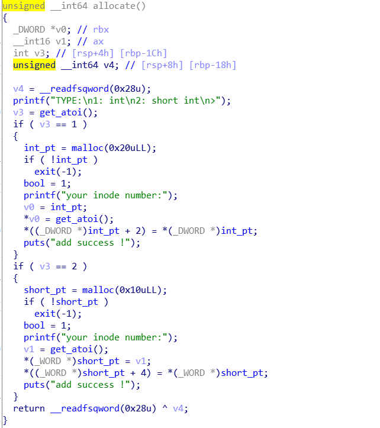
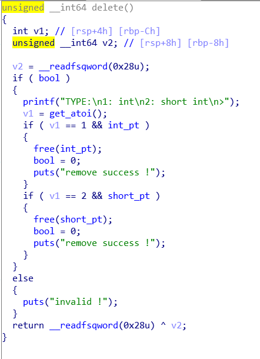
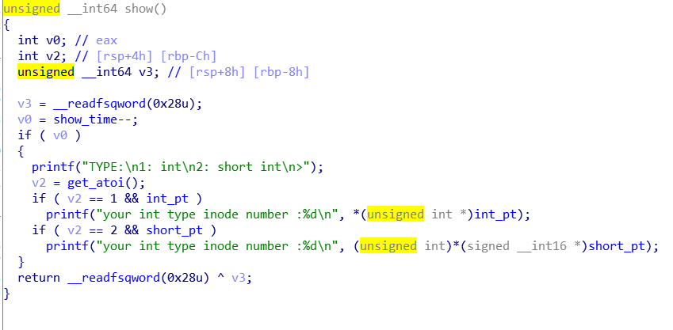
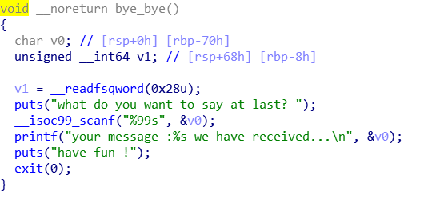
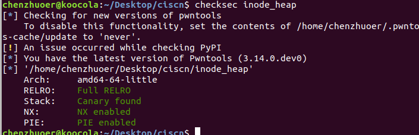
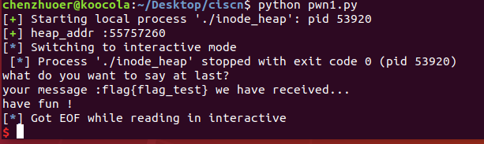

# 赛题设计说明

## 题目信息：

* 题目名称：inode_heap
* 预估难度：困难 
* 编译命令：gcc heap.c -o inode_heap -z noexecstack -fstack-protector-all -fPIE -pie -z now

## 题目描述：

> talk is cheap,  show me the flag

## 题目考点：

1. heap UAF
2. double free
3. seccomp沙箱
4. 对IO_FILE的中FILE_NO标志位的理解


## 思路简述：
IO_FILE结构体攻击，如果flag文件已经被打开，修改stdin->fileno标志位然后调用IO 读函数(如scanf)即可读入flag

把double free转换为tcache attack修改fastbin堆头大小为0x91，填满tcache,分配出unsortedbin，局部写unsortedbin fd指针处的libc地址使其指向stdin->fileno，修改stdin->fileno为666，然后退出即可泄露出flag


## 题目提示：
1.partial write
2. 注意IO_FILE结构
3. stdin->file_no


## 原始 flag 及更新命令：

```shell
    # 原始 flag
    flag{icq_test}
    # ..
    # 更新 flag 命令
    echo 'flag{85c2a01a-55f7-442a-8712-3f6908e1463a}' > /flag
```

## 题目环境：

1. Ubuntu 18.04 LTS
2. xinetd + chroot

## 题目制作过程：

1. 编写 pwn.c 代码，详细代码请从 “源码” 文件夹获取，
2. 写编译方式在源代码第一行，
3. 编写 xinetd 配置文件，设置好参数，
4. 编写 Dockerfile,修改为ubuntu18.04版本

## 题目 writeup：

### 程序分析
程序总共实现了四个功能，allocate,delete,show，bye_bye，并且ban掉了execve函数，打开了flag，并将flag的文件描述符设置为了666
#### allocate
allocate功能能分配出0x20,0x30两种大小的堆块，然后0x20大小的堆块会在(heap_base),(heap_base+8）处填入short int类型的两个数，0x30大小的堆块会在(heap_base),(heap_base+8)处填入int类型的两个数，如果allocate成功会把_bool标志位置为1，而且程序最多只保存两个指针，如果分配下一个同类型的堆块，会把上一个该类型堆块的指针覆盖

#### remove
delete功能实现了free堆块，然后把_bool标志位置为0

#### show
show功能只能使用两次，根据类型(int,short int)打印出allocate使输入的数，且没有检查_bool功能能是否

#### bye_bye
调用scanf功能输入你想输入的话，然后程序会把scanf读入的内容打印到屏幕上

#### checksec
checksec发现程序保护全开

#### 漏洞分析
漏洞存在于两种类型的堆块共用一个_bool(堆块是否使用)标志位，在remove的时候虽然把_bool标志清0了却并没有清零指针，所以remove一种类型的堆块后只要分配出另一种类型的堆块使得_bool标志位被重新置为1，那么就可以再次remove上种类型的堆块，就会造成double free,而且show函数中没有对堆块是否已经被free进行检验
#### 漏洞利用
1. 首先利用共用_bool标志位造成的double free漏洞获得一个指向自身的堆块(0x20大小)，然后用show功能leak heap基址的低二字节
2. 然后将该堆块分配到0x30大小堆块的堆头处，然后修改其堆头处的size大小为0x91(大小+上个堆块in_use标志位)
3. 利用double free漏洞填满0x91大小堆块的tcache，然后再次free即可得到一个unsortedbin，其fd,bk指针处为一个libc中main_arena+88的地址(也是0x30大小tcache处分配的下下个堆块的地址)
4. 用show功能获取main_arena+88地址的低4字节，然后计算出libc中stdin->fileno的低四字节
5. 分配0x20大小的堆块，此时会从unsortedbin中切割一部分，我们利用填入的short int类型的数partial write其为stdin->fileno
6. 这时分配0x30的堆块，由于分配出的堆块的fd指针是我们伪造的stdin->fileno，所以再分配0x30大小的堆块会分配到stdin->fileno处
7. 修改stdin->fileno为666，然后调用bye_bye函数，IO函数scanf就会从flag文件中读取到buf中，之后的printf函数打印buf内容时就会打印出flag，如图
	
8. 编写 exp.py ，获取flag，详细代码请从 “exp脚本” 文件夹获取
